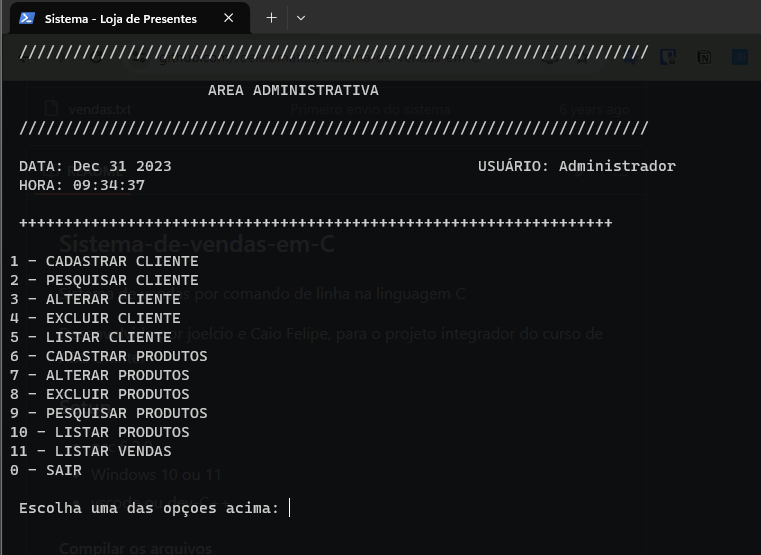

##  GiftShop-CLI
This is a Command Line Interface (CLI) Gift shop Management System written in pure C language for educational purposes

### Setup

* gcc 6.3.0 | install on C:\MinGW
* Windows 10 or 11
* vscode editor

#### Compile and run

``` 
make ; make run
```
or
```
gcc ./src/*.c ./src/*.h -o ./dist/shop.exe ; ./dist/shop.exe
```

### Admin area

